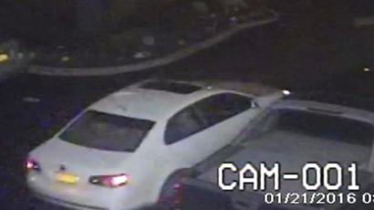
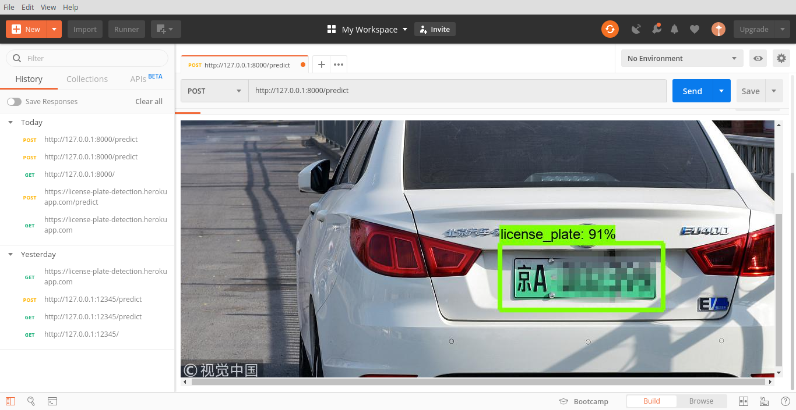
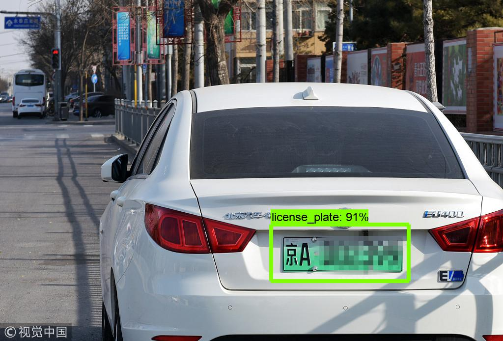

# license-plate-detection
`TCS humAIn`
This repo is the API for the `Detection` of a license plate.

# Usage:
`cd` into the folder and `conda create --name <environment name>` 
Now that the `environment` is ready, get inside the `environment`. 
After that
* `conda install tensorflow`
* `pip install Flask`
* `conda install opencv`
`cd` into object detection folder and run `app.py`, this will host a `RESTful` api. 
The API endpoint for the predictions is `<base url>/predict` which takes a `HTTP POST` and an image in the form-data.
 
# Input
Let's check our model shall we? 

# Postman Window
The model has been wrapped to a Flask application that can easily be hosted :fire: :raised_hands: :fire: 

# Output

